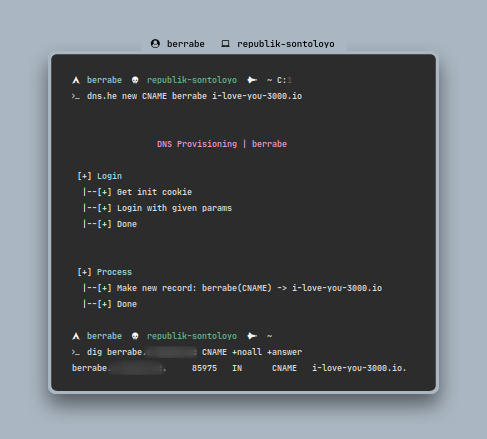
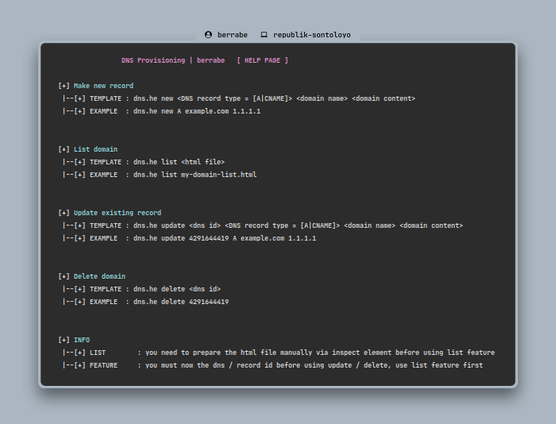

### INTRO
---
if you save dns / domain records on [dns.he.net](https://dns.he.net) you will definitely feel how tired it is to manage all of those domains, because everything has to be done manually, **YES MY FRIEND, MANUALLY** ..... So, this is where this script was created, to automate all those manual work so I can sleep well :D

and I want to thank burpsuite, you really helped me, because you know ..... they don't provide API :(

<br/><br/>


### SETUP
---
- just ... you know, download ... and make sure `/usr/local/bin` already on your `$PATH`

```sh
> curl -sLD - https://raw.githubusercontent.com/berrabe/dns-provisioning/master/dns.he -o /usr/local/bin
> chmod +x /usr/local/bin/dns.he 
> dns.he
```

<br/><br/>


### PICS
---
<br/><br/>

<p align="center">
  
</p>

<br/><br/>

<p align="center">
  
</p>

<br/><br/>
